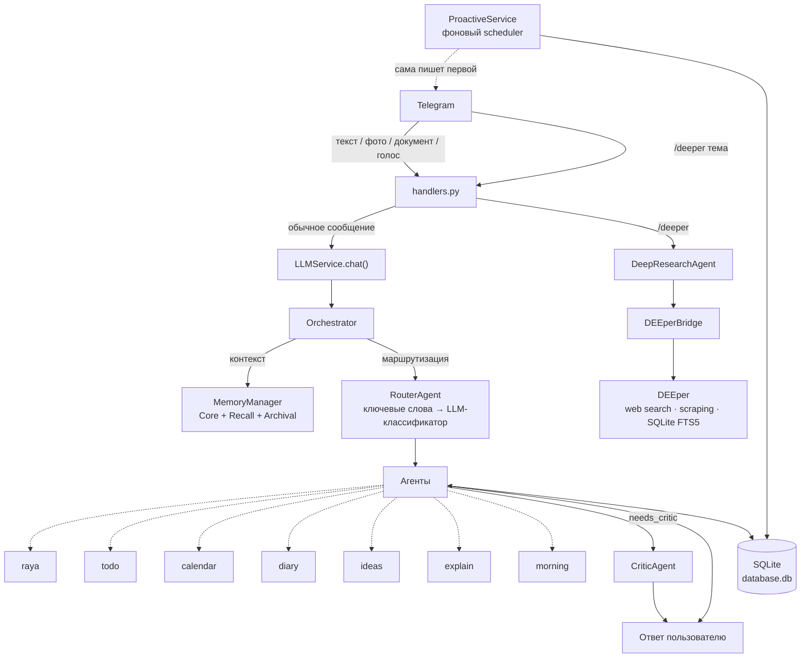

# RaYa + DEEper

Личная AI-система для одного пользователя.

## Архитектура



DEEper не знает о существовании Раи — единственная точка связи снизу.

## Структура

```
raya-deeper/
├── app/               # Рая — Telegram-бот, агенты, БД
│   ├── agents/        # Оркестратор + агенты (calendar, diary, todo, ...)
│   │   └── deep_research_agent.py  ← мост к DEEper
│   ├── config.py      # Конфиг (читает .env)
│   └── ...
├── deeper/            # DEEper — модуль поиска (дорабатывается отдельно)
│   ├── config.py      # Конфиг DEEper (тот же .env)
│   ├── services/      # ResearchAgent, KnowledgeBase, WebSearch, ...
│   └── utils/
├── tests/             # pytest — unit + integration тесты
├── data/              # SQLite (Railway: persistent volume /app/data)
├── main.py
├── requirements.txt
├── requirements-dev.txt  # pytest, ruff — только для разработки
├── railway.toml
└── .env.example       # → скопировать в .env и заполнить
```

## Тесты

```bash
pip install -r requirements.txt -r requirements-dev.txt
pytest tests/ -v
```

С отчётом покрытия:
```bash
pytest tests/ --cov=app --cov-report=term-missing
```

CI (`.github/workflows/tests.yml`) прогоняет весь набор на каждый push/PR в `main`.

## Интеграция DEEper

Единственная точка соединения: `app/agents/deep_research_agent.py → DEEperBridge`

- DEEper **не знает** о Рае — можно дорабатывать `deeper/` независимо
- Рая вызывает `bridge.research(topic, mode, progress_cb)` и получает `dict`
- Live-прогресс: каждый шаг DEEper обновляет сообщение в Telegram

## Деплой на Railway

1. Скопировать `.env.example` → `.env` и заполнить все ключи
2. Установить `OWNER_USER_ID` (свой Telegram ID)
3. `git push` → Railway автоматически деплоит
4. Persistent volume монтируется на `/app/data`

### Переменные Railway (Settings → Variables)
Все переменные из `.env.example` добавить вручную в Railway UI.
`.env` файл НЕ коммитится — только в Railway Variables.
